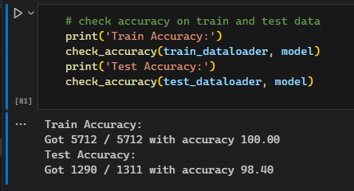

# Tumor Detector
This project was one I pursued as a means of understanding and working with CNNs while also attempting to create something that has a tangible impact (tumor detection). This is a continuation of a 3rd place hackathon project that I worked on in the past but aims to be both more useful and more accurate than our old model.

# Usage
In order to train the model that I've included in cnn.ipynb, you simply need to download the dataset from [this](https://www.kaggle.com/datasets/masoudnickparvar/brain-tumor-mri-dataset) Kaggle page.

After this, place the zip file in the same directory as cnn.ipynb and run all of the cells in the notebook. This will unzip the dataset, store it in a new directory called 'dataset', and train the model for 30 epochs. 

Depending on your compute power, this can take between a few minutes and a few hours. On my rig (Intel i5-7400 and a GeForce GTX 1060 6gb), training the model took just over 11 minutes. If you are having memory issues, try lowering the batch size until the model is able to train multiple epochs in succession.

By the end of training, I found that my model had reached 100% accuracy on the training data and 98.4% accuracy on the test data.

# Tech Used
This project was implemented using mainly PyTorch.

# Credit
The dataset for the project was downloaded [here](https://www.kaggle.com/datasets/masoudnickparvar/brain-tumor-mri-dataset).